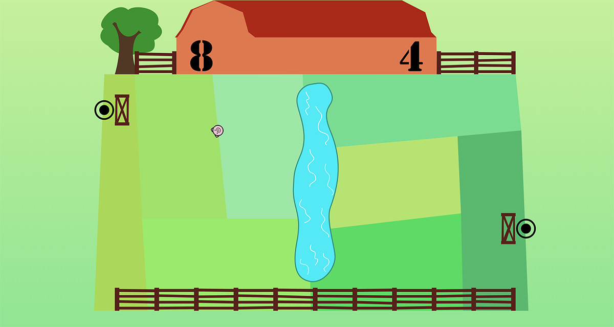

# Pig-Pong
My rendition of the iconic Pong arcade game.

## General Info
To further my skills in event-driven programming for a large state, I decided to try my hand at a remake of Pong. Being a sucker for colors and patterns I steered away from the game classic's Spartan looks. Instead, as a pun on ping-pong, I went for a farm theme :)

## Technologies Used
(Vanilla) JavaScript, CSS and HTML. I created all SVG illustrations using Affinity Designer.

## Features
This is an online game and fully responsive. I wanted to keep the game instructions to a minimum, so it might not be obvious the game can be played with 2 persons if played on a touchscreen device (or in the rare case one would have 2 computer mice at one's disposal). In line with Pong the winner is the player who first scores 11 points. Aside from the fun visuals I carefully selected fitting music and sound effects to add to the game enjoyment.

The game is suitable for beginners while challenging enough for more advanced players. The game speeds up in relation to the length of a rally. Hitting closer to the edge of the bat (as opposed to using the safer center area) is more risky but also more favorable. This is because it will result in steeper return angles, thus making it harder for the opponent to counter.

## Screenshot

## Usage
The SVG illustrations are used inline in the HTML, otherwise you can't manipulate them with JavaScript. The game is always in one of four phases: waiting, startup, playing or cooling. If you want to adjust the minimum or maximum speed, change the 'pigSpeedXMin' and 'pigSpeedXMax' constants accordingly (these hold the min./max. horizontal speed (in SVG units per millisecond), resp.). The 'pigSpeedXHit' constant is the speedup factor used when the pig hits the bat.  
Live demo of the game can be found here: https://rubberducky.rocks/projects/pig-pong/.
